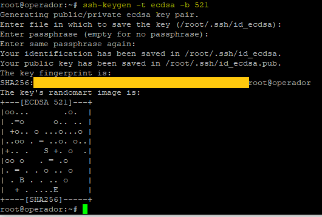

# oaisim-free5gc-install

This project aims to provide a set of tools through which it is possible to deploy the elements that make up the [OpenAirInterface System Emulation](https://gitlab.eurecom.fr/oai/openairinterface5g/wikis/OpenAirLTEEmulation) with the elements of [Free5GC](https://www.free5gc.org/) in a simple and automated way. For this, we break [OpenAirInterface](https://gitlab.eurecom.fr/oai/openairinterface5g/wikis/OpenAirLTEEmulation) and [Free5GC](https://www.free5gc.org/) into smaller elements, and place each of these elements in a [_Docker Conteiners_.](https://hub.docker.com/u/laboraufg)  , like as illustrated by the following image.


Elements of OpenAirInterface (UE and enB) can be executed without Free5GC, but the internet connection test presented in ["this project"](https://github.com/LABORA-INF-UFG/oaisim-free5gc-install#4---testing-user-equipments-ue-internet-connection) will only be executed correctly with all elements instaled.

To use the playbook you need the following elements:

1. A machine called _operator's machine_, running Linux and with a properly installed version of [Ansible](https://docs.ansible.com/). The [section 1](https://github.com/LABORA-INF-UFG/oaisim-free5gc-install#1---ansible-installation--configuration-operator-machine) will present the steps for installing Ansible.
2. Other's machine's (it's can be VM's or PC Bare Metal) for installing the Free5G elements and OpenAirSIM elements.


The figure below shows more details about the deployment environment:


We assume that the <b>all machines are connected to the internet</b> and <i>see each other</i>.
# Installation Guide
The first thing to do, is configure the <i>operator machine</i>.

## 1 - Ansible Installation / Configuration (Operator Machine)
Ansible's installation procedures depend on the inclusion of some repositories on the operator's machine. Depending on the distribution uses the commands for the inclusion of these repositories they can change, for more information see [this page](https://docs.ansible.com/ansible/latest/installation_guide/intro_installation.html#installing-the-control-node) . The next steps works to <b>linux Ubuntu 16.04.x LTS</b>. To add a new repository, run:
```
sudo apt-add-repository -y ppa:ansible/ansible-2.7
```
then, update the dependencies tree:
```
sudo apt-get update
```
and finally install Ansible with the following command:

```
sudo apt-get install ansible
```
After installation check if the installed version is 2.7 or higher using the following command:
```
ansible --version
```
the expected result should be equivalent to that shown in the image below:


### Access Settings (Operator Machine / Deployment Environment Machine)
After installing ansible on the operator's machine, the next step is to configure the connection between the operator's machine and the other machines involved in the OpenAir deployment process. For the correct operation, Ansible needs to have full access to the other machines involved, this is done through the exchange of <i>SSHKeys</i> process:

Generate an ssh key from the operator's machine using the following command:
```
ssh-keygen -t ecdsa -b 521
```
I recommend that you use  <i>empty passphrase</i>, the result should be equivalent to that shown in the image below:


This key will be used by <i>Ansible</i> when running the deployment playbooks, so we must copy that key to the other machines involved in the process and ensure that it stays in the **root directory of the respective machines**. To copy the operator's machine key to the machine where OAISim+free5gc will be deployed, use the following command:
```
ssh-copy-id -i ~/.ssh/id_ecdsa.pub <user>@<deployment-environment-host>
```
the result should be equivalent to that shown in the image below:


after copy ssh key, access the deployment machine ``` ssh <user>@<deployment-environment-host> ``` and run the following commands:
```
 apt install python-minimal -y
```
the last command install **python minimal**. This package contains the interpreter and some essential modules. It is used by Ansible for same basic tasks.

After install <i>python minimal</i>, we need get some information about **physical network interface** of the machine. To do this, run ```ifconfig``` and take note the **_physical network interface name_** display in the next figure.

this information will be necessary when executing the deployment playbook.

#### Test Ansible Connection (Operator Machine / Deployment Environment Machine)

On the <i>operator's machine</i> it will be necessary to clone this project to test the connection throught <i>Ansible</i>. To be possible, it is necessary to have **GIT** properly installed. You can check this with the following command:
```
git --version
```
the expected result should be something similar to:
```
git version x.x.x
```  
if GIT is not installed, just run the following command:
```
sudo apt-get install git
```
 
 Then choose a directory and clone the **oaisim-with-ansible project**:
```
git clone https://github.com/LABORA-INF-UFG/oaisim-free5gc-install.git
```
after clone, access the project folder and open the **hosts** file with a text editor (Nano, Vi). The file content is similar to:
```
[OAISim-with-free5gc]
<deployment-environment-IP-address>
```
replace the ```<deployment-environment-IP-address>``` for the IP address of the <i>deployment environment machine</i>. Save and close the file, and inside the project base directory run the next command:
```
ansible -i ./hosts -m ping all -u root
```
the expected result should be equivalent to that shown in the image below:


this means that everything is fine and that <i>Ansible</i> has full access to the <i>deployment machine</i>.
 
## 2 - Run Ansible Playbook (Free5G + OpenAirSIM Install)
 After configuration steps, just run the next command.
```
ansible-playbook    Deploy5GC.yml  -i  hosts -e "physical_network_interface=<< physical network interface name>>"
```
It will be start the process of deployment the elements of **OAISim + free5GC**. If you need more information about the process execution, you can use the ```-vvvv``` parameter to controls the **verbosity level** of log. This parameter can be adjusted in five diferent levels (```-v```, ```-vv```, ```-vvv``` or ```-vvvv```). 

One of the objectives of this project is to automate steps for setting up the _test environment_ involving OAISIm + free5GC. The configuration steps can be difficult and can lead to several problems, or this reason, we have automated the following steps: 
1. Build ```rcc.band7.tm1.nfapi.conf``` set _MME parameters_ connections.
2. Build ```ue.nfapi.conf```

You have the option to customize the deployment process, all customization parameters are presented in [section 5.](https://github.com/LABORA-INF-UFG/oaisim-free5gc-install/blob/master/README.md#5---customize-the-deployment-process)  


## 3 - Running and testing
After finish installation for default, **MongoDB** and **Web User Interface** is initialized. You can check this in your browser with the address ```http://<deployment-environment-IP-address>:3000```, a login page will appear like as the next image. 
 

The default access credentials are:
* User: **admin**
* Pass: **1423**

After accessing WebUI, check in main page the existence of UEs registered,  the result should be equivalent to that shown in the next figure:


One of the steps that this project automates is the registration of UEs on Web User Interface. By default, _ansible playbook_ adds 10 Ue's, however, this number can be expanded up to a maximum of 200 Ue's. To do this, just use the parameter ``` qtd_ues_init_database='N' ``` before or after the parameter ``` physical_network_interface=<< physical network interface name>> ```, replacing ```N``` by the number of UEs to be registered as described in [section 2.](https://github.com/LABORA-INF-UFG/oaisim-free5gc-install#2---run-ansible-playbook-free5g--openairsim-install) In parallel to this, _ansible playbook_ also registers all UE's added in Web User Interface in the respective configuration file ```ue.nfapi.conf``` inside in UE element.

If you access the deployment machine and type ```docker ps```, you can see that all the elements ar running, the result should be equivalent to that shown in the next figure:
 

Now, we will __run__ the other 5GC elements, for this, access the deployment machine with 7 different terminal's and in each terminal run the follow steps.

### Running AMF
Access the _first terminal_ and and run the following commands:
```
docker exec -ti amf bash
/root/free5gc-stage-1/install/bin/free5gc-amfd 
```
the result should be equivalent to that shown in the next figure:
 

### Running UPF
Access the _secound terminal_ and and run the following commands:
```
docker exec -ti upf bash
/root/free5gc-stage-1/install/bin/free5gc-upfd
```
the result should be equivalent to that shown in the next figure:
 

### Running SMF
Access the _third terminal_ and and run the following commands:
```
docker exec -ti smf bash
/root/free5gc-stage-1/install/bin/free5gc-smfd
```
the result should be equivalent to that shown in the next figure:
 

the green mark in the figure, represents the _UPF Association Response_ container reaction when SMF is initialized.

### Running HSS
Access the _fourth terminal_ and and run the following commands:
```
docker exec -ti hss bash
/root/free5gc-stage-1/install/bin/nextepc-hssd 
```
the result should be equivalent to that shown in the next figure:
 

the green mark in the figure, represents the _AMF Connection_ container reaction when HSS is initialized.

### Running PCRF
Access the _fifth terminal_ and and run the following commands:
```
docker exec -ti pcrf bash
/root/free5gc-stage-1/install/bin/nextepc-pcrfd 
```
the result should be equivalent to that shown in the next figure:
 

the green mark in the figure, represents the _SMF Connection_ container reaction when PCRF is initialized.

So far all the elements of the _free5gC_ have been initialized, the next will be elements of the _OpenAirSIM_.

### Running enB
Access the _sixth terminal_ and and run the following commands:
```
docker exec -ti enb bash
cd /root/enb/cmake_targets/ran_build/build
sudo -E ./lte-softmodem -O /root/enb/ci-scripts/conf_files/rcc.band7.tm1.nfapi.conf 
```
the result should be equivalent to that shown in the next figure:
 
The _enB_ terminal will be in constant loop displaying the next message ``` Waiting fo PHY_config_req```. The green mark in the figure, represents the _AMF enB Registration_ container reaction when enB is initialized.

### Running UE
Access the _seventh terminal_ and and run the following commands:
```
docker exec -ti ue bash
cd /root/ue/cmake_targets/ran_build/build
./lte-uesoftmodem -O /root/ue/ci-scripts/conf_files/ue.nfapi.conf --L2-emul 3 --num-ues 1 --nums_ue_thread 1 --nokrnmod 1
```
the result should be equivalent to that shown in the next figure:
 
The alert messages are not relevant.

## 4 - Testing User Equipments (UE) Internet Connection
Now we can test the UE internet connection. For this, access the deployment machine and type ``` docker exec -ti ue bash ``` to access de UE Container. Inside the container type ```ifconfig``` to check network interface. The result should be equivalent to that shown in the next figure:
 

Now type ``` ping google.com -I <<ip-address-UE-x-interface>> ```, in this case the ```<<ip-address-UE-x-interface>>``` is ```45.45.0.2```, so the test is: ``` ping google.com -I 45.45.0.2 ```. The result should be equivalent to that shown in the next figure:
 

## 5 - Customize the deployment process
If you want to deploy only the [OpenAirInterface System Emulation](https://gitlab.eurecom.fr/oai/openairinterface5g/wikis/OpenAirLTEEmulation) elements and do not deploy [Free5GC](https://www.free5gc.org/) components, you can set the parameter ```deploy_free5gc``` with ``` 'false' ```. The deployment command would be in the following format:
```
ansible-playbook    Deploy5GC.yml  -i  hosts -e "physical_network_interface=<< physical network interface name>> deploy_free5gc='false'"
```
